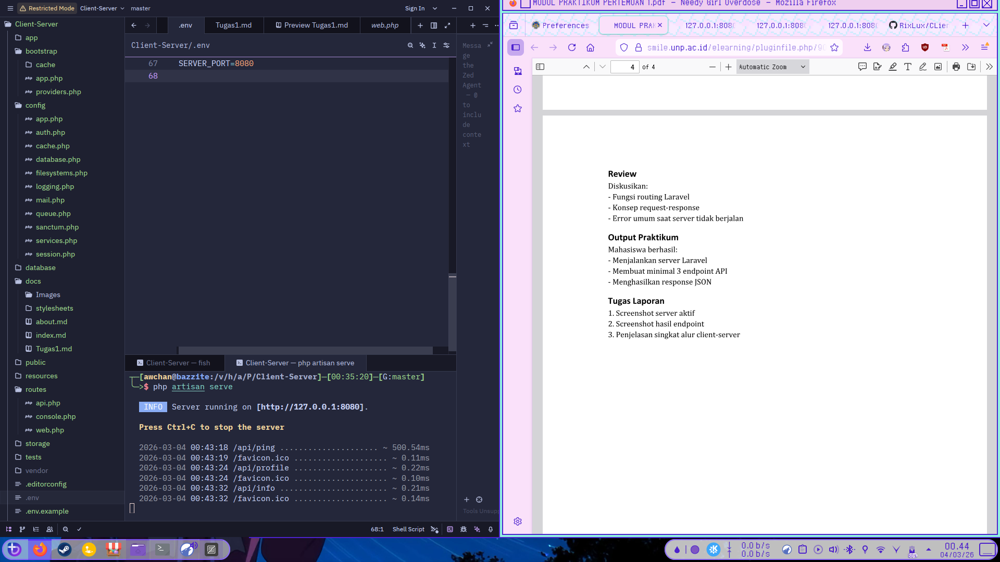
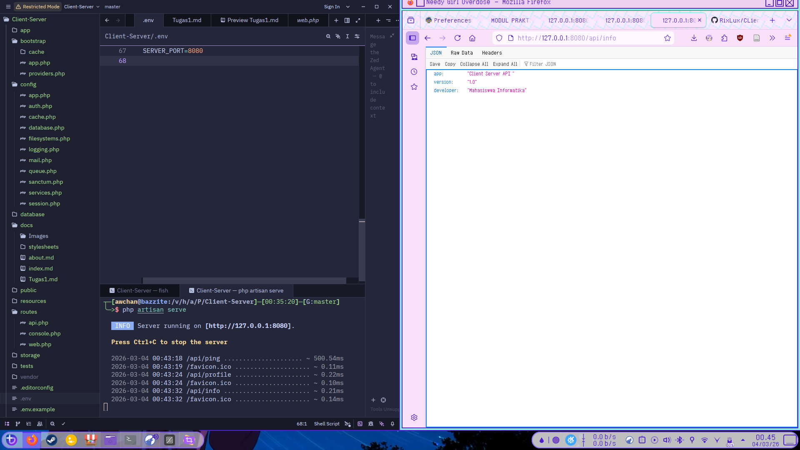

# Laporan Praktikum: Dasar Routing dan Konsep Client-Server Laravel

## A. Dasar Teori

### 1. Fungsi Routing Laravel

Routing dalam Laravel bertindak sebagai **"Petugas Navigasi"**. Fungsinya adalah menerima *request* dari URL yang diketikkan pengguna di browser, lalu meneruskannya ke bagian kode yang sesuai (biasanya Controller atau Anonymous Function).

* **Lokasi File:** Umumnya berada di `routes/web.php` untuk aplikasi web.
* **Keunggulan:** Memungkinkan pembuatan URL yang bersih (Clean URL) dan mendukung berbagai metode HTTP seperti `GET`, `POST`, `PUT`, dan `DELETE`.

### 2. Konsep Request-Response

Ini adalah siklus dasar komunikasi di internet:

* **Request:** Pesan yang dikirimkan oleh **Client** (Browser) ke server. Berisi data seperti URL, metode HTTP, *header*, dan terkadang data form.
* **Response:** Pesan balasan dari **Server** kembali ke client. Berisi status code (seperti 200 OK atau 404 Not Found) dan konten (HTML, JSON, atau file).

### 3. Error Umum Saat Server Tidak Berjalan

Jika kamu mencoba mengakses aplikasi Laravel namun server (`php artisan serve`) belum diaktifkan, kamu akan menemui beberapa kendala:

* **"This site can’t be reached" (ERR_CONNECTION_REFUSED):** Browser tidak menemukan layanan yang mendengarkan (listening) di port tersebut (biasanya 8000).
* **Connection Timed Out:** Terjadi jika server sangat lambat merespons atau ada firewall yang memblokir, namun dalam konteks lokal biasanya karena server memang mati.

---

## B. Tugas Laporan

### 1. Screenshot Server Aktif

> 
> *Keterangan: Menunjukkan pesan "Server running on [[http://127.0.0.1:8080](http://127.0.0.1:8080)]"*

### 2. Screenshot Hasil Endpoint

**Info**  
  

---

**ping**
  

---

**profile**

### 3. Penjelasan Singkat Alur Client-Server

Berdasarkan praktikum yang dilakukan, alurnya adalah sebagai berikut:

1. **User/Client** mengetikkan alamat URL di browser.
2. **Request** dikirim melalui jaringan menuju server lokal (localhost).
3. **Laravel Router** menerima request tersebut dan mencocokkan URL-nya.
4. **Logic/Controller** memproses data (jika ada) dan menyiapkan balasan.
5. **Server** mengirimkan **Response** balik ke browser.
6. **Browser** merender kode tersebut menjadi tampilan yang kita lihat.
