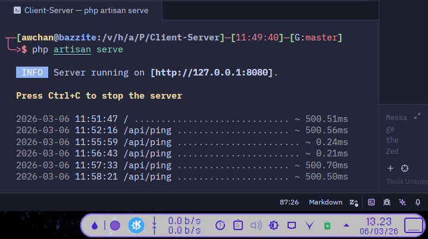
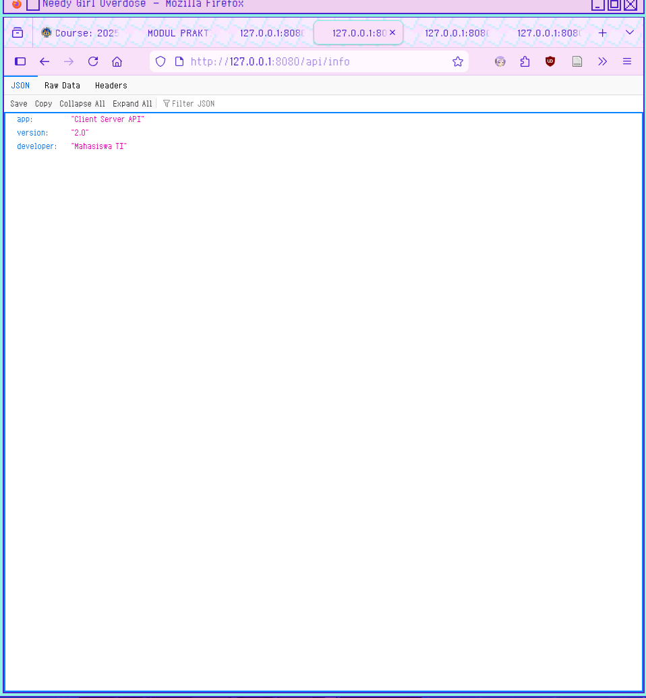
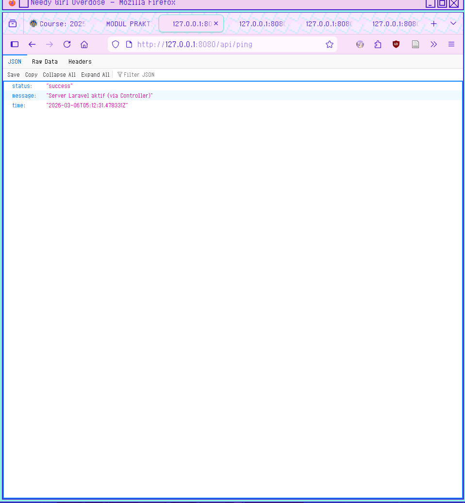
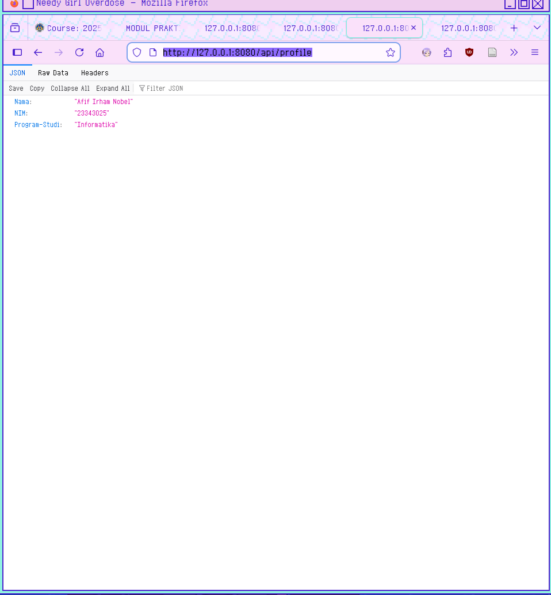
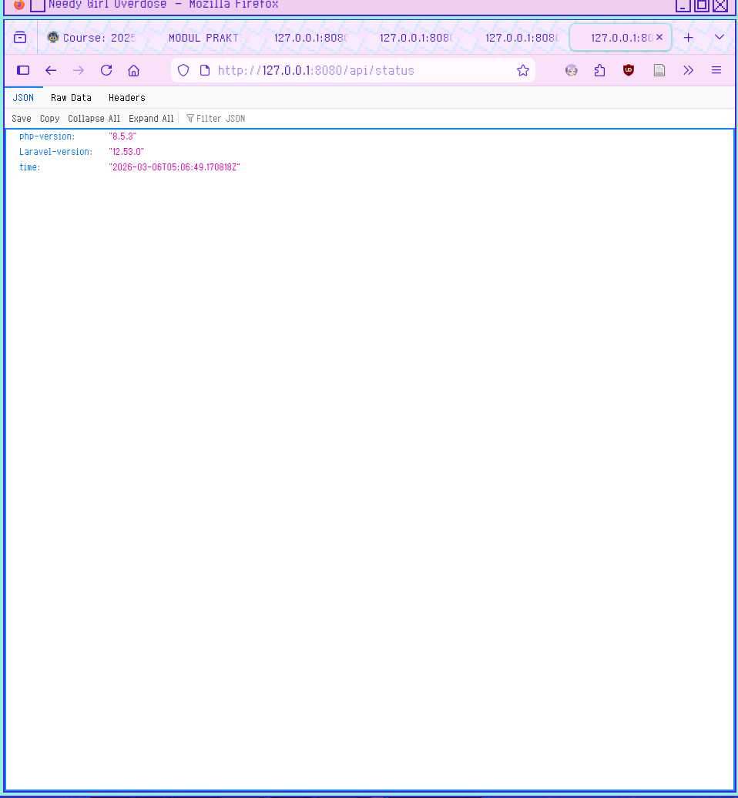

# Laporan Praktikum 2

## 1. Kenapa Controller lebih baik daripada Closure?

Secara teknis, **Closure** (fungsi anonim langsung di file route) memang bekerja, tapi **Controller** menang dalam hal manajemen kode.

* **Caching Route:** Laravel memiliki fitur `route:cache` yang mempercepat performa aplikasi secara signifikan. Sayangnya, Laravel **tidak bisa melakukan cache** pada rute yang menggunakan Closure.
* **Kerapihan (Clean Code):** Closure membuat file rute (seperti `web.php`) menjadi sangat panjang dan sulit dibaca jika logika aplikasi sudah kompleks.
* **Dependency Injection:** Meskipun Closure mendukungnya, Controller jauh lebih bersih dalam menangani *constructor injection* untuk memanggil berbagai Service atau Repository.

---

## 2. Apa Keuntungan Pemisahan Routing & Logic?

Bayangkan file routing sebagai **peta jalan** dan Controller sebagai **tujuannya**. Jika peta jalan dicampur dengan bangunan tujuannya, peta tersebut akan sulit dibaca.

### Contoh Perbandingan:

**Menggunakan Closure (Buruk untuk skala besar):**

```php
// routes/web.php
Route::get('/user/{id}', function ($id) {
    $user = User::findOrFail($id);
    // Logika bisnis yang panjang...
    return view('user.profile', ['user' => $user]);
});

```

**Menggunakan Controller (Lebih Rapi):**

```php
// routes/web.php
use App\Http\Controllers\UserController;

Route::get('/user/{id}', [UserController::class, 'show']);

// app/Http/Controllers/UserController.php
public function show($id) {
    $user = User::findOrFail($id);
    return view('user.profile', compact('user'));
}

```

**Keuntungan Utama:**

1. **Reusability:** Logika di Controller bisa dipanggil oleh rute lain (misal: rute web dan rute API).
2. **Organisasi:** Kamu tahu persis di mana harus mencari kode jika ingin mengubah fitur tertentu.
3. **Kolaborasi:** Developer A bisa fokus merapikan rute, sementara Developer B fokus memperbaiki logika di Controller.

---

## 3. Bagaimana jika Project Makin Besar?

Saat project tumbuh menjadi ribuan baris kode, Controller biasa pun bisa menjadi "gemuk" (*Fat Controller*). Di sinilah pola arsitektur lanjutan berperan:

| Strategi | Penjelasan |
| --- | --- |
| **Single Action Controller** | Menggunakan satu Controller hanya untuk satu tugas (menggunakan method `__invoke`). |
| **Service Pattern** | Memindahkan logika bisnis dari Controller ke class **Service** terpisah. |
| **Request Validation** | Menggunakan `FormRequest` agar Controller tidak penuh dengan aturan validasi `if-else`. |

### Contoh Struktur Project Besar:

Jika project sudah sangat besar, Controller kamu seharusnya hanya "menerima tamu" dan "memberikan jawaban", bukan "memasak di dapur".

```php
// app/Http/Controllers/OrderController.php
public function store(OrderRequest $request, OrderService $orderService) 
{
    // Validasi otomatis dilakukan oleh OrderRequest
    
    // Logika bisnis dilakukan oleh Service
    $order = $orderService->createOrder($request->validated());

    return response()->json($order, 201);
}

```

## Tugas Laporan

### 1. Screenshot Server Aktif

> 
> *Keterangan: Menunjukkan pesan "Server running on [[http://127.0.0.1:8080](http://127.0.0.1:8080)]"*

### 2. Screenshot Hasil Endpoint

**Info**  
> 

---

**ping**
> 

---

**profile**
> 

---

**status**
> 
