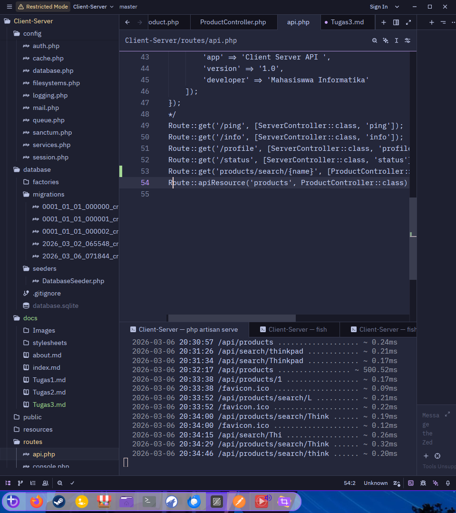
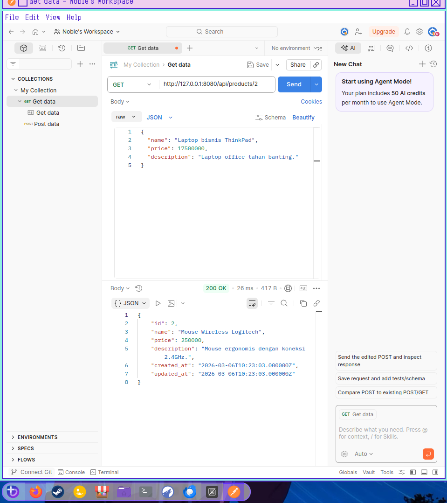
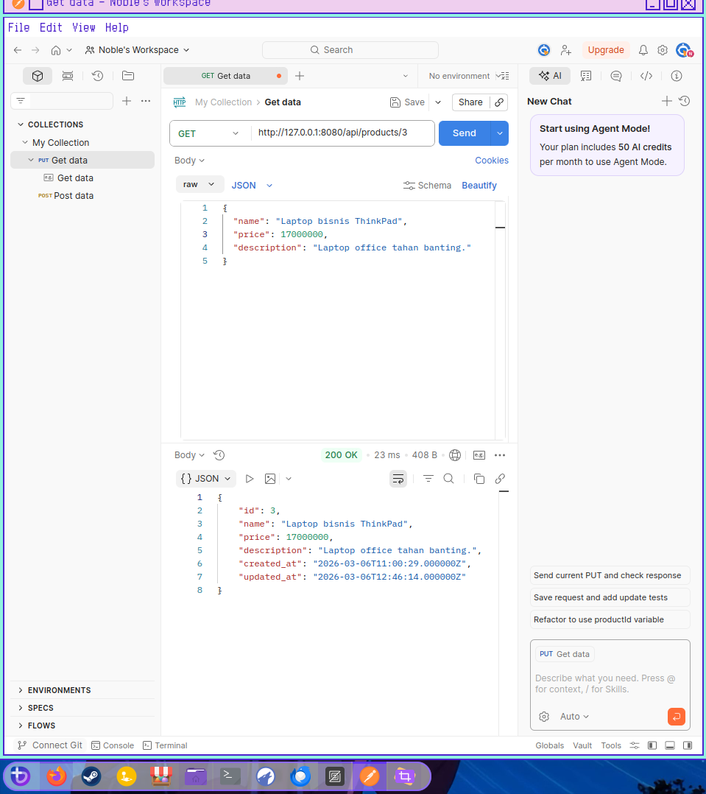
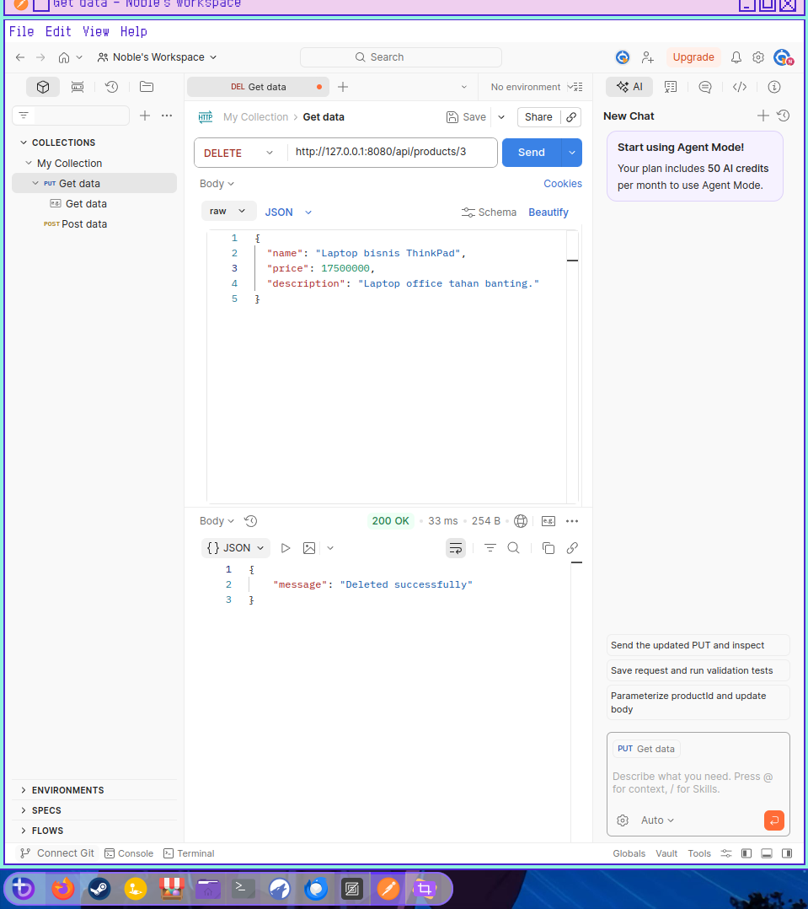
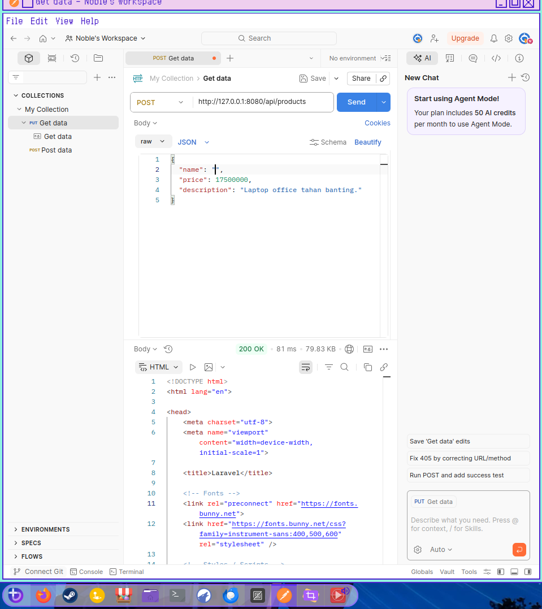
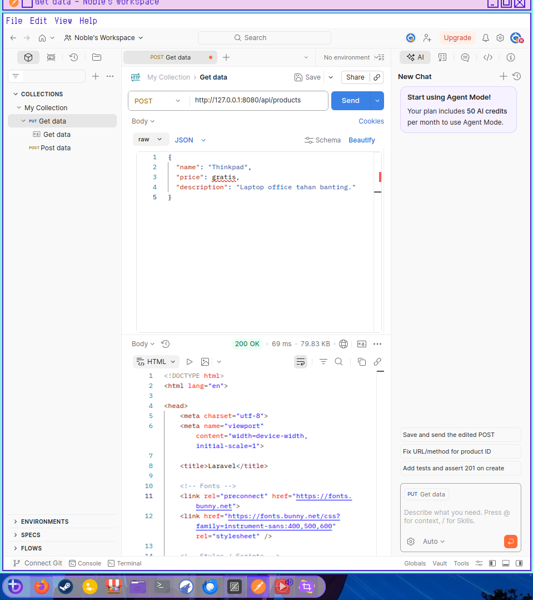
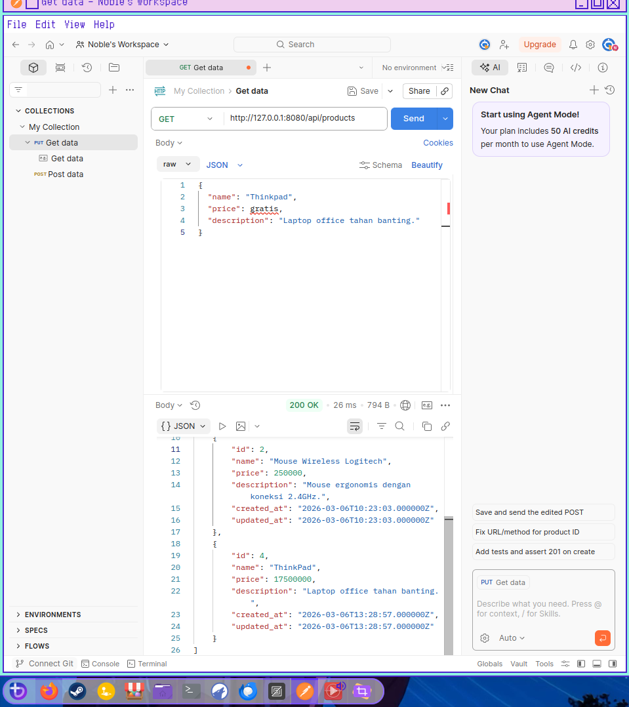
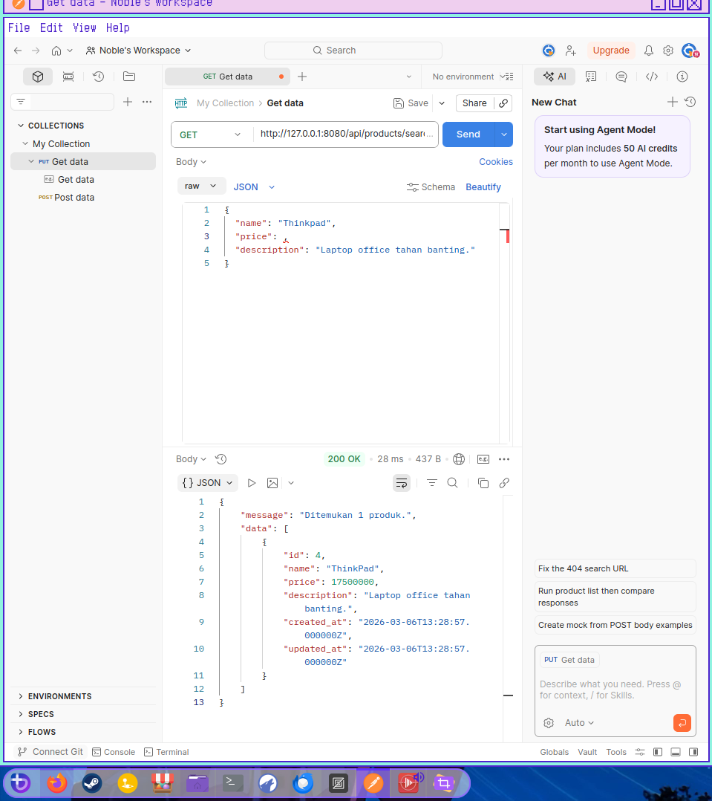

## 1. Kenapa Kita Pakai `apiResource`?

Dalam Laravel, `apiResource` adalah cara kilat untuk mendaftarkan rute CRUD (Create, Read, Update, Delete) yang standar untuk API. Bedanya dengan `resource` biasa adalah ia **mengabaikan** rute yang mengembalikan tampilan HTML (seperti `create` dan `edit`), karena API hanya berfokus pada data (JSON).

**Alasannya:**

* **Efisiensi:** Cukup satu baris kode untuk 5 rute utama.
* **Standarisasi:** Mengikuti konvensi penamaan URL yang konsisten.

**Contoh Kode:**
Di file `routes/api.php`:

```php
use App\Http\Controllers\ProductController;
use Illuminate\Support\Facades\Route;

// Tanpa apiResource, kamu harus ngetik satu-satu:
// Route::get('/products', [ProductController::class, 'index']);
// Route::post('/products', [ProductController::class, 'store']); ... dsb.

// Dengan apiResource:
Route::apiResource('products', ProductController::class);

```

---

## 2. Apa itu ORM?

**ORM (Object-Relational Mapping)** adalah teknik yang memungkinkan kita berinteraksi dengan database menggunakan bahasa pemrograman yang kita pakai (dalam hal ini PHP/OOP), bukannya menulis query SQL mentah yang panjang. Di Laravel, ORM-nya bernama **Eloquent**.

**Contoh Kode:**
Jika kita ingin mengambil produk yang harganya di atas 50.000:

* **Tanpa ORM (SQL):** `SELECT * FROM products WHERE price > 50000;`
* **Dengan Eloquent ORM:**

```php
$products = Product::where('price', '>', 50000)->get();

```

Lebih manusiawi dan mudah dibaca, bukan?

---

## 3. Apa Risiko Jika Tidak Pakai `$fillable`?

Properti `$fillable` adalah sistem keamanan untuk mencegah **Mass Assignment Vulnerability**. Jika kamu tidak mendefinisikan `$fillable` (atau `$guarded`), orang luar bisa mengirimkan data "jahat" melalui form atau API untuk mengubah kolom yang seharusnya rahasia.

**Risikonya:** User bisa mengubah status `is_admin` menjadi `true` atau mengganti saldo akun mereka sendiri hanya dengan menyisipkan field tambahan di request JSON.

**Contoh Kode Bahaya:**

```php
// Di Model Product tanpa $fillable
class Product extends Model {
    // Kosong...
}

// Di Controller
// Jika user iseng mengirimkan data {"price": 100, "is_featured": true} 
// padahal "is_featured" harusnya hanya diubah oleh admin.
Product::create($request->all()); // BOOM! Data tidak terfilter.

```

---

## 4. Kenapa REST Penting di Industri?

**REST (Representational State Transfer)** adalah "bahasa gaul" standar yang disepakati oleh aplikasi di seluruh dunia untuk saling mengobrol.

**Alasannya penting di industri:**

1. **Interoperabilitas:** Aplikasi Android (Java), iOS (Swift), dan Web (React) bisa mengambil data dari server yang sama (Laravel) karena semuanya mengerti format JSON yang dikirim via REST.
2. **Stateless:** Server tidak perlu mengingat setiap user yang konek, sehingga aplikasi lebih mudah diperbesar (**Scalable**) jika penggunanya jutaan.
3. **Keteraturan:** Menggunakan metode HTTP yang jelas fungsinya:
* `GET`: Ambil data.
* `POST`: Buat data baru.
* `PUT/PATCH`: Update data.
* `DELETE`: Hapus data.

## Tugas Laporan

### 1. Screenshot Server Aktif

> 
> *Keterangan: Menunjukkan pesan "Server running on [[http://127.0.0.1:8080](http://127.0.0.1:8080)]"*

### 2. Screenshot Hasil Endpoint CRUD

- **GEtbyID**  
>     

    

---

- **PUTbyID**
>   

---

- **DeletebyID**
> 

---

### 3. Mini Challenge

- **FailedPOSTbyEmptyName**
> 

---

- **FailedPOSTbyInvalidPrice**
> 

---

**ProofNoPOSTworking**


- **Endpoint /api/products/search/{name}**




### FootNote

```
use Illuminate\Database\Eloquent\Factories\HasFactory;
```

> di Modul ini tidak ada ditambahkan jadi harus ditambah manual di `app/Models/Product.php`
