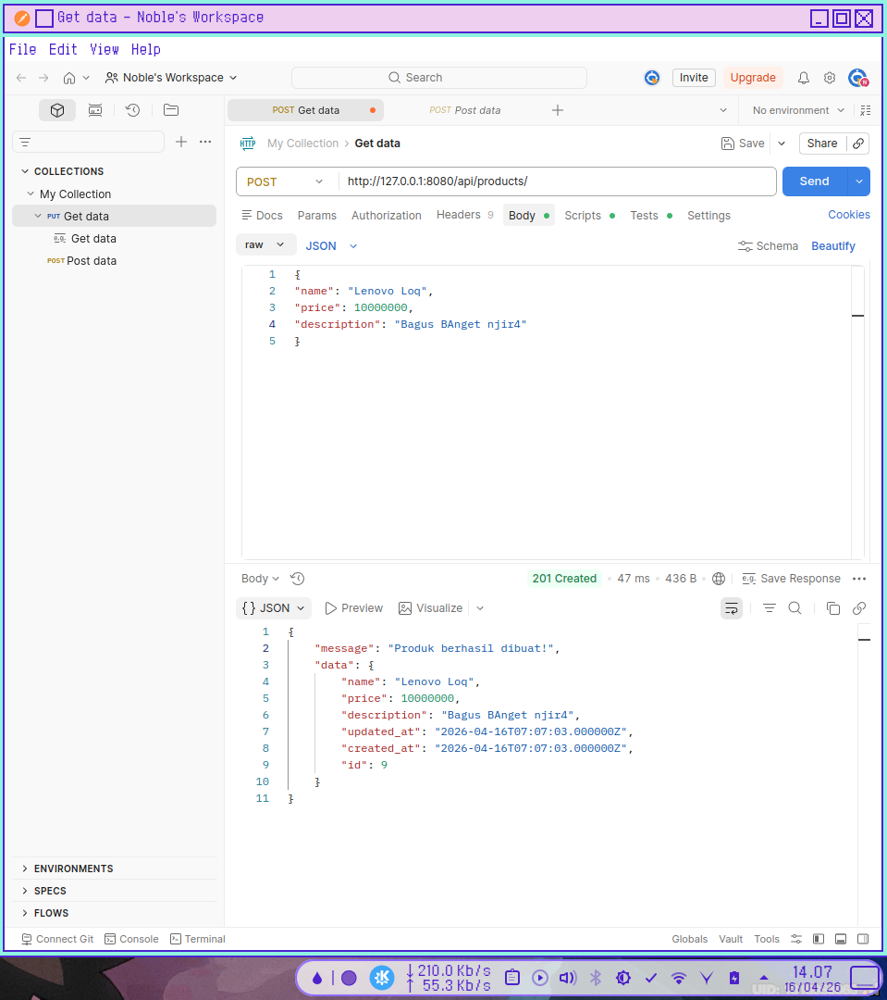
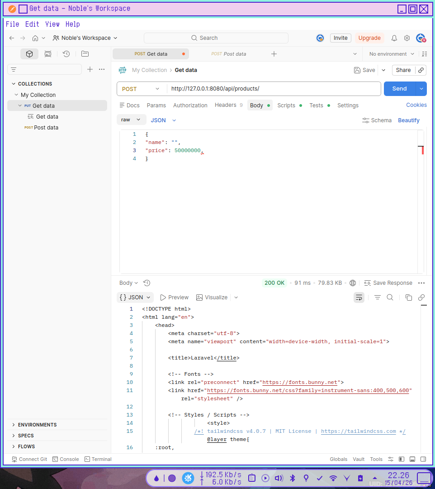
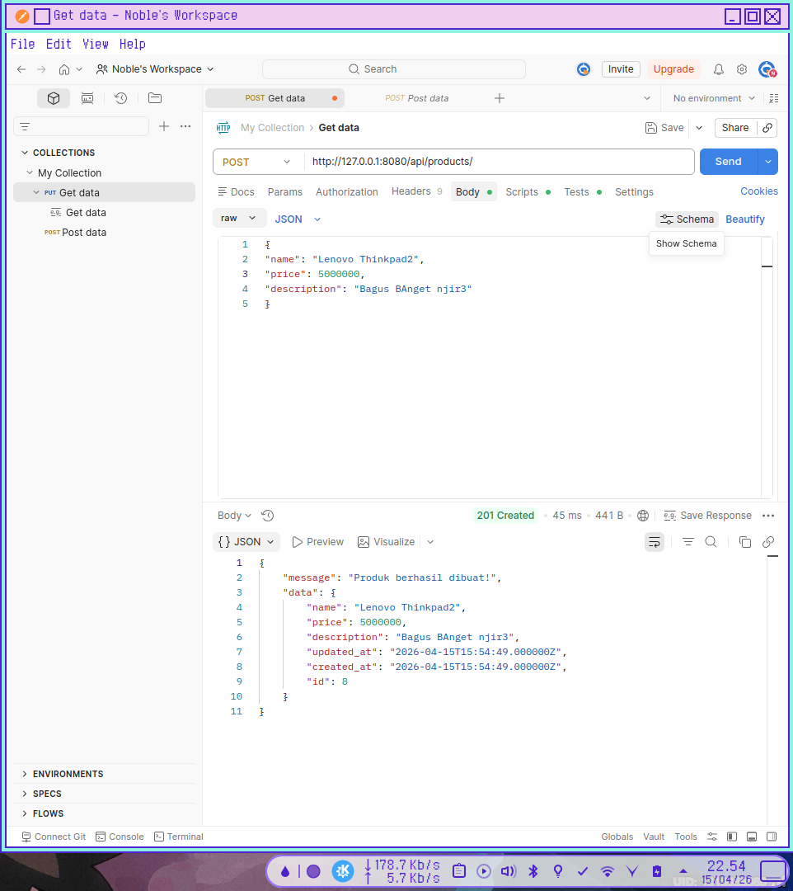
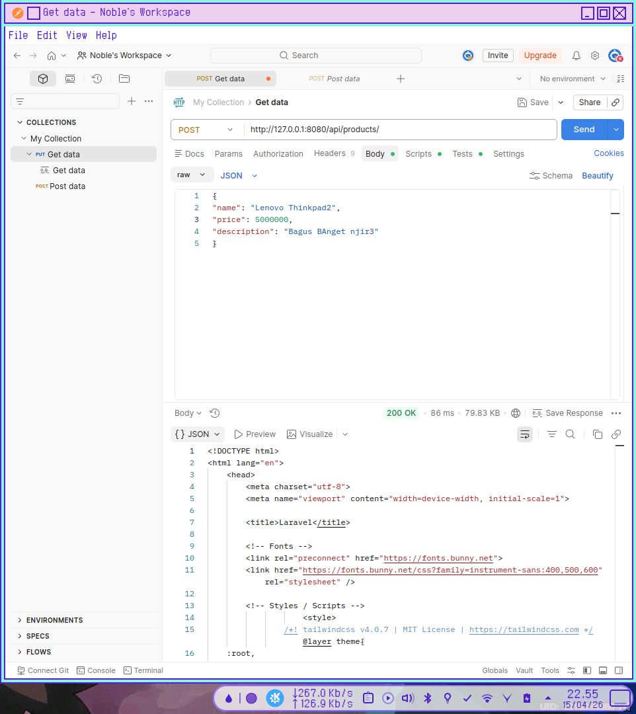

# **MODUL PRAKTIKUM PERTEMUAN 4**  

## **Implementasi Validation dan Error Handling pada REST API**  

## **Langkah Kerja Praktikum**

### 1.Menambahkan Validation pada Method Store

> Dari `app/Http/Requests/StoreProductRequest.php` Implementasi  berbeda dengan praktikum sebagai tes memisahkan logic dari kode utama.

```
    public function rules(): array
    {
        return [
        'name'  => 'required|string|min:3|max:255|',
        'price' => 'required|numeric|min:1000|max:100000000',
        'description' => 'nullable|string|max:255',
        ];
    }
```

### 2.Menambahkan Validation pada Method Update

> Dari `app/Http/Requests/UpdateProductRequest.php` di sini saya membuat class baru dengan mengextend function dari class StoreProductRequest.

```
class UpdateProductRequest extends StoreProductRequest
{
    public function rules(): array
    {
        $rules = parent::rules();

        $rules['name'] = 'sometimes|string|min:3|max:255|';
        $rules['price'] = 'sometimes|numeric|min:1000|max:100000000';

        return $rules;
    }
}
```
  
  
### 3.Menguji Validation POST Menggunakan Postman  
  
  
- **Data yang benar**  

Buka aplikasi Postman. Pilih method POST  
```
http://127.0.0.1:8080/api/products  
```
Body → raw → JSON  



- **Data yang Salah**

  

pengujian gagal dengan data berikut
```
{
"name": "",
"price": 50000000,
}
```

## **Latihan** 

Kerjakan tugas berikut.  

### 1. Tambahkan aturan validasi berikut pada field **name**
```
'name' => 'required|unique:products,name'
```

Contoh lengkap:  
```
    public function rules(): array
    {
        return [
        'name'  => 'required|string|min:3|max:255|unique:products,name',
        'price' => 'required|numeric|min:1000|max:100000000',
        'description' => 'nullable|string|max:255',
        ];
    }
```
> hal ini juga berlaku untuk update

### 2. Coba tambahkan produk dengan nama yang sama dua kali.  


  

  

### 3. Amati respon error yang diberikan oleh server  

> Server Menolak POST dengan nama yang sama dengan memberi status 200 OK yang berarti gagal setelah validasi

## **Diskusi**

### 1. Mengapa Validasi Harus Dilakukan pada Sisi Server?

Validasi sisi server adalah garis pertahanan terakhir dan paling krusial bagi aplikasi. Alasan utamanya adalah:

* **Keamanan:** Pengguna dapat dengan mudah melewati validasi sisi klien (seperti mematikan JavaScript di browser atau menggunakan alat seperti Postman/cURL untuk mengirim permintaan langsung ke API). Tanpa validasi server, sistem rentan terhadap serangan seperti *SQL Injection* atau *Cross-Site Scripting* (XSS).
* **Integritas Data:** Server bertanggung jawab memastikan bahwa data yang masuk ke basis data benar-benar sesuai dengan format dan aturan bisnis yang ditetapkan.
* **Konsistensi:** Jika aplikasi memiliki beberapa antarmuka (misalnya aplikasi Android dan Website), validasi di server memastikan aturan yang sama diterapkan untuk semua sumber input tersebut.

### 2. Perbedaan Validasi pada Client dan Server

Secara sederhana, validasi klien berfokus pada **pengalaman pengguna (UX)**, sedangkan validasi server berfokus pada **keamanan dan kebenaran data**.

| Fitur | Validasi Client (Sisi Klien) | Validasi Server (Sisi Server) |
| :--- | :--- | :--- |
| **Lokasi** | Berjalan di browser atau perangkat pengguna (HTML5, JavaScript). | Berjalan di server backend (PHP, Python, Node.js, dll). |
| **Kecepatan** | Sangat cepat (instan) karena tidak perlu mengirim data ke internet. | Lebih lambat karena membutuhkan perjalanan data (*round-trip*) ke server. |
| **Tujuan Utama** | Memberikan umpan balik cepat kepada pengguna agar formulir mudah diisi. | Melindungi sistem dan memastikan data yang masuk "bersih". |
| **Keandalan** | Rendah (dapat dimanipulasi atau dimatikan oleh pengguna). | Tinggi (tidak dapat diintervensi oleh pengguna luar). |


### 3. Mengapa Sistem Harus Menolak Data yang Tidak Valid?

Menolak data yang tidak valid bukan sekadar masalah teknis, tetapi juga masalah operasional:

* **Mencegah Kerusakan Data (Data Corruption):** Jika data sampah atau format yang salah masuk ke basis data, hal ini dapat menyebabkan *error* pada fungsi aplikasi lainnya (seperti saat melakukan kalkulasi atau laporan).
* **Efisiensi Sumber Daya:** Memproses data yang salah hanya akan membuang-buang siklus CPU dan ruang penyimpanan. Lebih baik menghentikan proses sejak awal.
* **Kejelasan bagi Pengguna:** Dengan menolak data dan memberikan pesan kesalahan yang tepat, pengguna tahu bagian mana yang harus diperbaiki.
* **Kepatuhan Aturan Bisnis:** Misalnya, jika sebuah sistem mengharuskan usia minimal 18 tahun, menerima data di bawah itu akan melanggar logika bisnis yang telah ditentukan.

