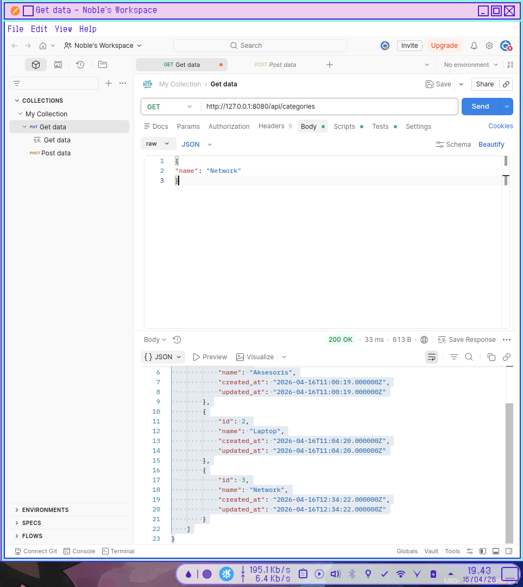
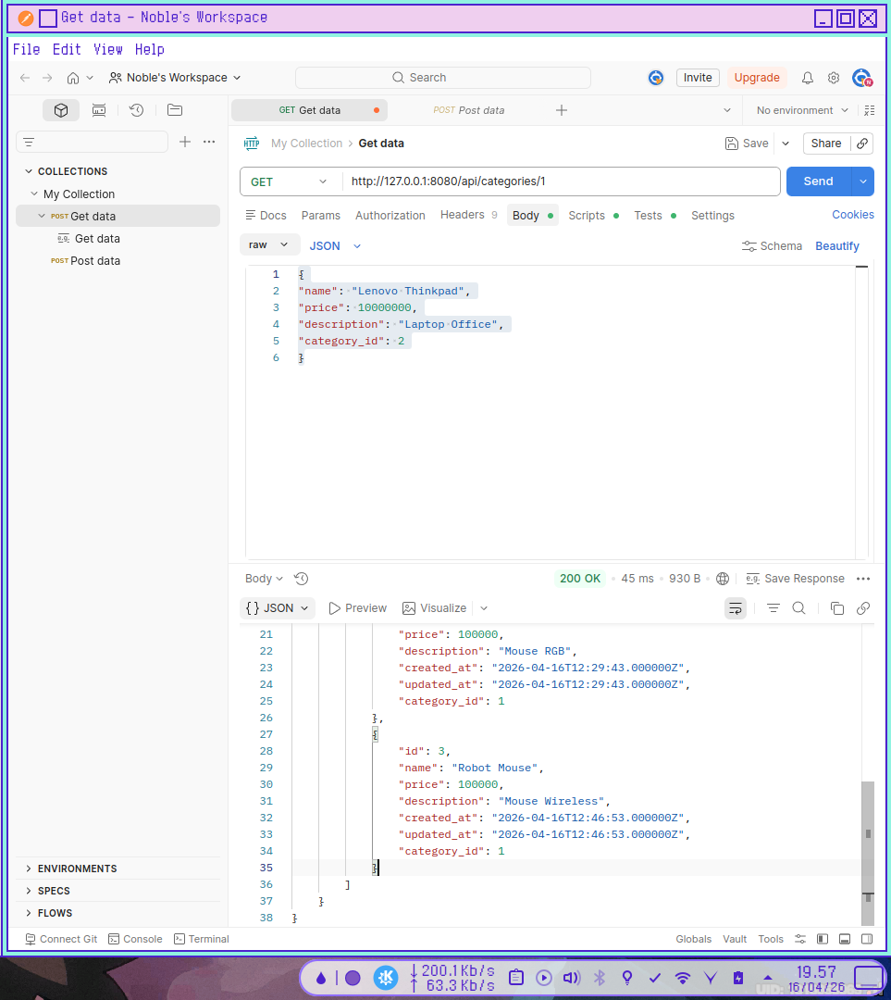

# **MODUL PRAKTIKUM PERTEMUAN 5**

## Implementasi Relasi Database pada REST API Laravel

## **Langkah Kerja Praktikum**

### 1. Membuat Migration Tabel Categories

Jalankan perintah berikut pada terminal.  
```
php artisan make:migration create_categories_table
```

---

### 2. Membuat Struktur Tabel categories
Buka file migration yang baru dibuat pada folder:  
```
database/migrations
```
Kemudian ubah kode menjadi:  
```
public function up(): void
{
    Schema::create('categories', function (Blueprint $table) {
        $table->id();
        $table->string('name');
        $table->timestamps();
    });
}s
```

### 3. Menjalankan Migration
Jalankan perintah berikut untuk membuat tabel pada database.  
```
php artisan migrate
```

Setelah berhasil maka tabel categories akan muncul di database.  

### 4. Menambahkan Foreign Key pada Tabel Products
Buat migration baru.
```
php artisan make:migration add_category_id_to_products_table
```
Kemudian ubah kode migration menjadi
```
public function up(): void
{
    Schema::table('products', function (Blueprint $table) {
        $table->foreignId('category_id')
              ->constrained()
              ->onDelete('cascade');
    });
}
```
Jalankan kembali migration
```
php artisan migrate
```

```
 php artisan migrate

   INFO  Running migrations.  

  2026_04_16_084940_add_category_id_to_products_table ..... 43.22ms FAIL

   Illuminate\Database\QueryException 

  SQLSTATE[23000]: Integrity constraint violation: 1452 Cannot add or update a child row: a foreign key constraint fails (`clientserver_db`.`#sql-alter-656-b`, CONSTRAINT `products_category_id_foreign` FOREIGN KEY (`category_id`) REFERENCES `categories` (`id`) ON DELETE CASCADE) (Connection: mysql, Host: 127.0.0.1, Port: 3306, Database: clientserver_db, SQL: alter table `products` add constraint `products_category_id_foreign` foreign key (`category_id`) references `categories` (`id`) on delete cascade)

  at vendor/laravel/framework/src/Illuminate/Database/Connection.php:838
    834▕             $exceptionType = $this->isUniqueConstraintError($e)
    835▕                 ? UniqueConstraintViolationException::class
    836▕                 : QueryException::class;
    837▕ 
  ➜ 838▕             throw new $exceptionType(
    839▕                 $this->getNameWithReadWriteType(),
    840▕                 $query,
    841▕                 $this->prepareBindings($bindings),
    842▕                 $e,

      +9 vendor frames 

  10  database/migrations/2026_04_16_084940_add_category_id_to_products_table.php:14
      Illuminate\Support\Facades\Facade::__callStatic("table")
      +26 vendor frames 

  37  artisan:16
      Illuminate\Foundation\Application::handleCommand(Object(Symfony\Component\Console\Input\ArgvInput))

```

> Dapat issue di sini karena data di products yang sudah ada karena praktikum sebelumnya tidak memiliki data untuk category_id jadi harus hapus semua data dulu.  

Jalankan ini untuk hapus semua data dan lakukan semua dari awal:  
```
php artisan migrate:fresh
```

### 5. Membuat Model Category
Jalankan perintah berikut.
```
php artisan make:model Category
```
Model akan dibuat pada folder:`app/Models`

### 6. Menambahkan Relationship pada Model
Buka file Category.php :  
```
class Category extends Model
{
    public function products()
    {
        return $this->hasMany(Product::class);
    }
}
```  

Buka di flie Product.php:  
```
class Product extends Model
{
   use HasFactory;
   protected $fillable = [
   'name',
   'price',
   'description',
   'category_id'
   ];

   public function category()
   {
       return $this->belongsTo(Category::class);
   }
}
```  

### 7. Menampilkan Data Relasi pada API
Buka `app/Http/Controllers/ProductController`  
Ubah method index() menjadi:  
```
public function index()
{
    $products = Product::with('category')->get();

    return response()->json($products);
}
```
Method tersebut akan menampilkan data produk beserta kategorinya.  

### 8. Menguji API Menggunakan Postman

1. Menambahkan Data Category  
Endpoint:`POST /api/categories`  
Body JSON:  
```
{
"name": "Network"
}
```  
Jika Berhasil JSON akan menampilkan:
```
{
    "message": "Kategori berhasil ditambahkan!",
    "data": {
        "name": "Network",
        "updated_at": "2026-04-16T12:34:22.000000Z",
        "created_at": "2026-04-16T12:34:22.000000Z",
        "id": 3
    }
}
```
2. Menambahkan Data Produk dengan Category  
Setelah kategori berhasil dibuat,selanjutnya tambahkan produk yang memiliki kategori.  
Method:POST  
URL:
[http://127.0.0.1:8080/api/products](http://127.0.0.1:8080/api/products)  
Body JSON:  
```
{
"name": "Crown Mouse",
"price": 100000,
"description": "Mouse RGB",
"category_id": 1
}
```
Jika berhasil maka JSON akan menampilkan :  
```
{
    "message": "Produk berhasil dibuat!",
    "data": {
        "name": "Crown Mouse",
        "price": 100000,
        "description": "Mouse RGB",
        "category_id": 1,
        "updated_at": "2026-04-16T12:29:43.000000Z",
        "created_at": "2026-04-16T12:29:43.000000Z",
        "id": 2
    }
}
```
3. Menampilkan Semua Data Produk  
Untuk menampilkan semua produk yang ada di database gunakan endpoint
berikut.  
Method:GET  
URL:[http://127.0.0.1:8000/api/products](http://127.0.0.1:8000/api/products)  
Jika berhasil maka akan muncul data produk beserta kategori yang
dimilikinya.
```
[
    {
        "id": 1,
        "name": "Logitech Mouse",
        "price": 100000,
        "description": "Mouse RGB",
        "created_at": "2026-04-16T11:45:43.000000Z",
        "updated_at": "2026-04-16T11:45:43.000000Z",
        "category_id": 1,
        "category": {
            "id": 1,
            "name": "Aksesoris",
            "created_at": "2026-04-16T11:00:19.000000Z",
            "updated_at": "2026-04-16T11:00:19.000000Z"
        }
    },
    {
        "id": 2,
        "name": "Crown Mouse",
        "price": 100000,
        "description": "Mouse RGB",
        "created_at": "2026-04-16T12:29:43.000000Z",
        "updated_at": "2026-04-16T12:29:43.000000Z",
        "category_id": 1,
        "category": {
            "id": 1,
            "name": "Aksesoris",
            "created_at": "2026-04-16T11:00:19.000000Z",
            "updated_at": "2026-04-16T11:00:19.000000Z"
        }
    }
]
```

---

## Latihan

Kerjakan tugas berikut.
### 1. Tambahkan minimal 2 kategori produk.
```
{
"name": "Laptop"
}
```

```
{
"name": "Network"
}
```

```
{
    "message": "Daftar kategori berhasil diambil.",
    "data": [
        {
            "id": 1,
            "name": "Aksesoris",
            "created_at": "2026-04-16T11:00:19.000000Z",
            "updated_at": "2026-04-16T11:00:19.000000Z"
        },
        {
            "id": 2,
            "name": "Laptop",
            "created_at": "2026-04-16T11:04:20.000000Z",
            "updated_at": "2026-04-16T11:04:20.000000Z"
        },
        {
            "id": 3,
            "name": "Network",
            "created_at": "2026-04-16T12:34:22.000000Z",
            "updated_at": "2026-04-16T12:34:22.000000Z"
        }
    ]
}
```  


### 2. Tambahkan minimal 3 produk yang memiliki kategori berbeda.

```
{
"name": "Robot Mouse",
"price": 100000,
"description": "Mouse Wireless",
"category_id": 1
}
```

```
{
"name": "Mikrotik hAP Lite  RB941-2nD",
"price": 100000,
"description": "Access Point",
"category_id": 3
}
```

```
{
"name": "Lenovo Thinkpad",
"price": 10000000,
"description": "Laptop Office",
"category_id": 2
}
```


### 3. Tampilkan seluruh produk menggunakan endpoint API.
```
[
    {
        "id": 1,
        "name": "Logitech Mouse",
        "price": 100000,
        "description": "Mouse RGB",
        "created_at": "2026-04-16T11:45:43.000000Z",
        "updated_at": "2026-04-16T11:45:43.000000Z",
        "category_id": 1,
        "category": {
            "id": 1,
            "name": "Aksesoris",
            "created_at": "2026-04-16T11:00:19.000000Z",
            "updated_at": "2026-04-16T11:00:19.000000Z"
        }
    },
    {
        "id": 2,
        "name": "Crown Mouse",
        "price": 100000,
        "description": "Mouse RGB",
        "created_at": "2026-04-16T12:29:43.000000Z",
        "updated_at": "2026-04-16T12:29:43.000000Z",
        "category_id": 1,
        "category": {
            "id": 1,
            "name": "Aksesoris",
            "created_at": "2026-04-16T11:00:19.000000Z",
            "updated_at": "2026-04-16T11:00:19.000000Z"
        }
    },
    {
        "id": 3,
        "name": "Robot Mouse",
        "price": 100000,
        "description": "Mouse Wireless",
        "created_at": "2026-04-16T12:46:53.000000Z",
        "updated_at": "2026-04-16T12:46:53.000000Z",
        "category_id": 1,
        "category": {
            "id": 1,
            "name": "Aksesoris",
            "created_at": "2026-04-16T11:00:19.000000Z",
            "updated_at": "2026-04-16T11:00:19.000000Z"
        }
    },
    {
        "id": 5,
        "name": "Mikrotik hAP Lite  RB941-2nD",
        "price": 100000,
        "description": "Access Point",
        "created_at": "2026-04-16T12:51:16.000000Z",
        "updated_at": "2026-04-16T12:51:16.000000Z",
        "category_id": 3,
        "category": {
            "id": 3,
            "name": "Network",
            "created_at": "2026-04-16T12:34:22.000000Z",
            "updated_at": "2026-04-16T12:34:22.000000Z"
        }
    },
    {
        "id": 6,
        "name": "Lenovo Thinkpad",
        "price": 10000000,
        "description": "Laptop Office",
        "created_at": "2026-04-16T12:52:26.000000Z",
        "updated_at": "2026-04-16T12:52:26.000000Z",
        "category_id": 2,
        "category": {
            "id": 2,
            "name": "Laptop",
            "created_at": "2026-04-16T11:04:20.000000Z",
            "updated_at": "2026-04-16T11:04:20.000000Z"
        }
    }
]
```

### 4. Tampilkan satu kategori beserta semua produk yang dimilikinya
```
{
    "message": "Detail kategori berhasil ditemukan.",
    "data": {
        "id": 1,
        "name": "Aksesoris",
        "created_at": "2026-04-16T11:00:19.000000Z",
        "updated_at": "2026-04-16T11:00:19.000000Z",
        "products": [
            {
                "id": 1,
                "name": "Logitech Mouse",
                "price": 100000,
                "description": "Mouse RGB",
                "created_at": "2026-04-16T11:45:43.000000Z",
                "updated_at": "2026-04-16T11:45:43.000000Z",
                "category_id": 1
            },
            {
                "id": 2,
                "name": "Crown Mouse",
                "price": 100000,
                "description": "Mouse RGB",
                "created_at": "2026-04-16T12:29:43.000000Z",
                "updated_at": "2026-04-16T12:29:43.000000Z",
                "category_id": 1
            },
            {
                "id": 3,
                "name": "Robot Mouse",
                "price": 100000,
                "description": "Mouse Wireless",
                "created_at": "2026-04-16T12:46:53.000000Z",
                "updated_at": "2026-04-16T12:46:53.000000Z",
                "category_id": 1
            }
        ]
    }
}
```


## Diskusi

### 1. Mengapa relasi database penting dalam sistem informasi?
Relasi database sangat penting karena sistem informasi di dunia nyata terdiri dari data yang saling terhubung (misalnya: ada **Produk**, dan produk itu milik **Kategori** tertentu). 

* **Menghindari Redundansi (Duplikasi) Data:** Tanpa relasi, kita mungkin akan menulis nama kategori berkali-kali di setiap baris produk. Dengan relasi, kita cukup menulis nama kategori satu kali di tabelnya sendiri.
* **Konsistensi Data:** Jika nama kategori berubah (misal: dari "Aksesoris" menjadi "Gadget"), kita hanya perlu mengubah satu baris di tabel `categories`, dan semua produk yang terhubung akan otomatis mengikuti.
* **Integritas Data:** Memastikan tidak ada data "yatim piatu". Misalnya, sistem bisa mencegah penghapusan kategori jika masih ada produk di dalamnya.


---

### 2. Apa fungsi Foreign Key dalam database?
*Foreign Key* (Kunci Tamu) adalah sebuah kolom (seperti `category_id`) pada satu tabel yang merujuk ke kolom kunci utama (*Primary Key*, biasanya `id`) di tabel lain. Fungsinya adalah:

* **Penghubung Antar Tabel:** Menjadi "jembatan" fisik secara teknis di dalam mesin database (MySQL/PostgreSQL) yang mengunci hubungan dua tabel.
* **Menjaga Referensial:** Mencegah kita memasukkan data yang tidak ada. Kita tidak bisa mengisi `category_id` dengan angka `99` jika di tabel `categories` tidak ada ID `99`.
* **Aksi Otomatis (Cascade):** Seperti yang digunakan di kode sebelumnya (`onDelete('cascade')`), *Foreign Key* memungkinkan penghapusan otomatis. Jika kategori dihapus, maka semua produk yang berhubungan akan ikut terhapus otomatis oleh database.


---

### 3. Apa keuntungan menggunakan Eloquent Relationship pada Laravel?
Meskipun kita bisa menghubungkan tabel menggunakan SQL manual (JOIN), Eloquent Relationship (seperti `belongsTo` dan `hasMany`) menawarkan banyak kemudahan:

* **Sintaks yang Ekspresif (Readable):** Kode `$product->category->name` jauh lebih mudah dibaca dan dipahami dibandingkan harus menulis query `SELECT` dengan `JOIN` yang panjang.
* **Efisiensi Query (Eager Loading):** Dengan fitur seperti `with()`, Laravel membantu kita menghindari masalah performa (N+1 Query) dengan cara mengambil data relasi secara cerdas dalam sedikit query.
* **Otomatisasi Tipe Data:** Eloquent secara otomatis mengubah hasil database menjadi objek PHP yang bisa langsung kita manipulasi tanpa perlu *parsing* manual.
* **Keamanan:** Eloquent menggunakan *prepared statements* secara bawaan, sehingga hubungan antar data kamu terlindungi dari serangan *SQL Injection*.

## Catatan Tambahan

Hal tambahan yang dilakukan di luar modul

### 1. Category.php  
Menambahkan kode ini pada `app/Models/Category.php`:  
```
<?php

namespace App\Models;

use Illuminate\Database\Eloquent\Factories\HasFactory;
use Illuminate\Database\Eloquent\Model;

class Category extends Model
{
    use HasFactory;

    protected $fillable = [
        'name'
    ];

    public function products()
    {
        return $this->hasMany(Product::class);
    }
}
```

### 2. Membuat CategoryController.php
kode ini ada di `app/Http/Controllers/Api/CategoryController.php`:  
```
<?php

namespace App\Http\Controllers\Api;

use App\Http\Controllers\Controller;
use App\Models\Category;
use Illuminate\Http\Request;

class CategoryController extends Controller
{
    /**
     * Menampilkan daftar semua kategori.
     */
    public function index()
    {
        $categories = Category::all();
        
        return response()->json([
            'message' => 'Daftar kategori berhasil diambil.',
            'data'    => $categories
        ], 200);
    }

    /**
     * Menyimpan kategori baru.
     */
    public function store(Request $request)
    {
        $validated = $request->validate([
            'name' => 'required|string|unique:categories,name|max:255'
        ]);

        $category = Category::create($validated);

        return response()->json([
            'message' => 'Kategori berhasil ditambahkan!',
            'data'    => $category
        ], 201);
    }

    /**
     * Menampilkan detail satu kategori beserta produk di dalamnya.
     */
    public function show(Category $category)
    {
        // Memuat produk yang berelasi dengan kategori ini
        return response()->json([
            'message' => 'Detail kategori berhasil ditemukan.',
            'data'    => $category->load('products')
        ], 200);
    }

    /**
     * Memperbarui data kategori.
     */
    public function update(Request $request, Category $category)
    {
        $validated = $request->validate([
            'name' => 'required|string|max:255|unique:categories,name,' . $category->id
        ]);

        $category->update($validated);

        return response()->json([
            'message' => 'Kategori berhasil diperbarui!',
            'data'    => $category
        ], 200);
    }

    /**
     * Menghapus kategori.
     */
    public function destroy(Category $category)
    {
        $category->delete();

        return response()->json([
            'message' => 'Kategori berhasil dihapus!'
        ], 200);
    }
}
```

### 3. Update routes/api.php

```
App\Http\Controllers\Api\CategoryController;

Route::apiResource('categories', CategoryController::class);
```

### 4. Penggunaan API categories
Contoh Penggunaan:  

* GET /api/categories -> Melihat semua kategori.

* POST /api/categories -> Menambah kategori (Body: name).

* GET /api/categories/1 -> Melihat kategori ID 1 dan semua produknya.

* PUT /api/categories/1 -> Mengubah nama kategori ID 1.

* DELETE /api/categories/1 -> Menghapus kategori.
