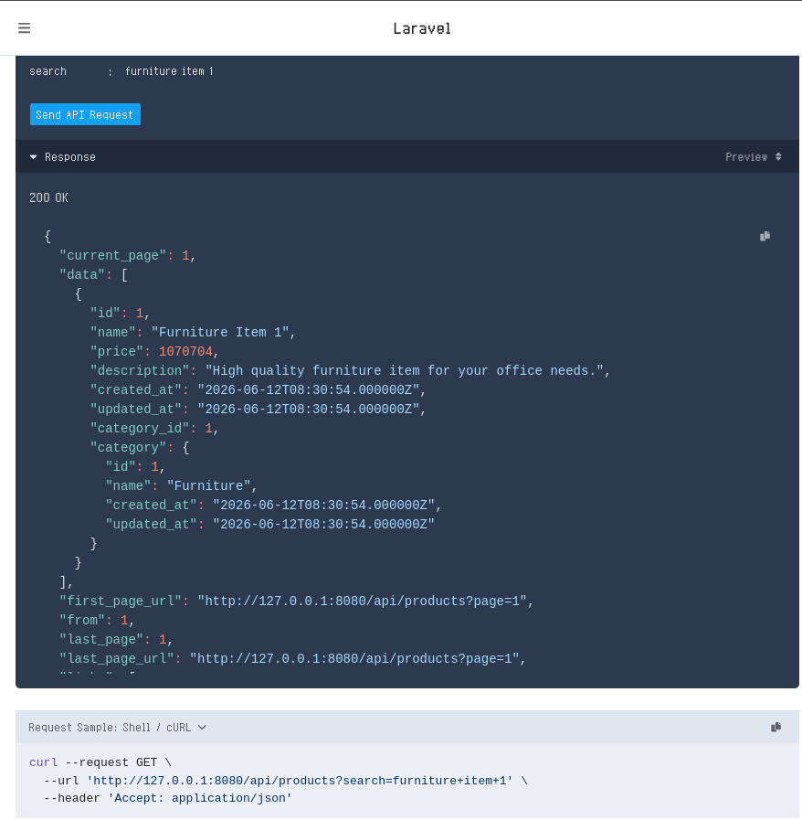
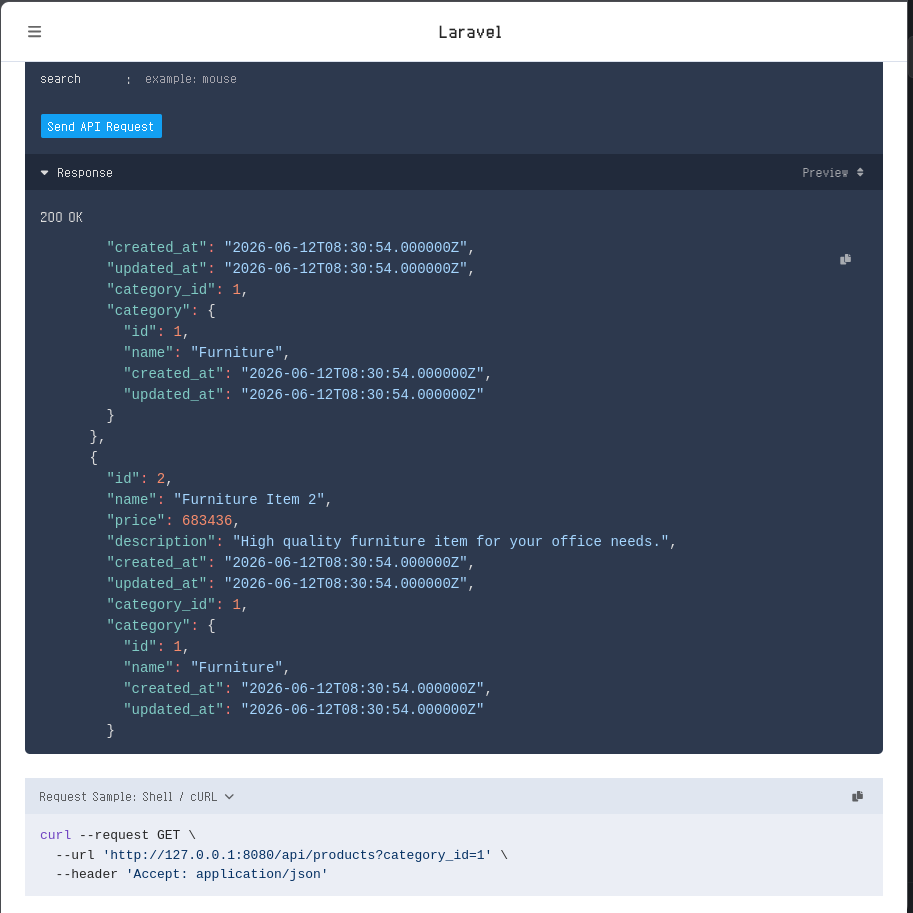
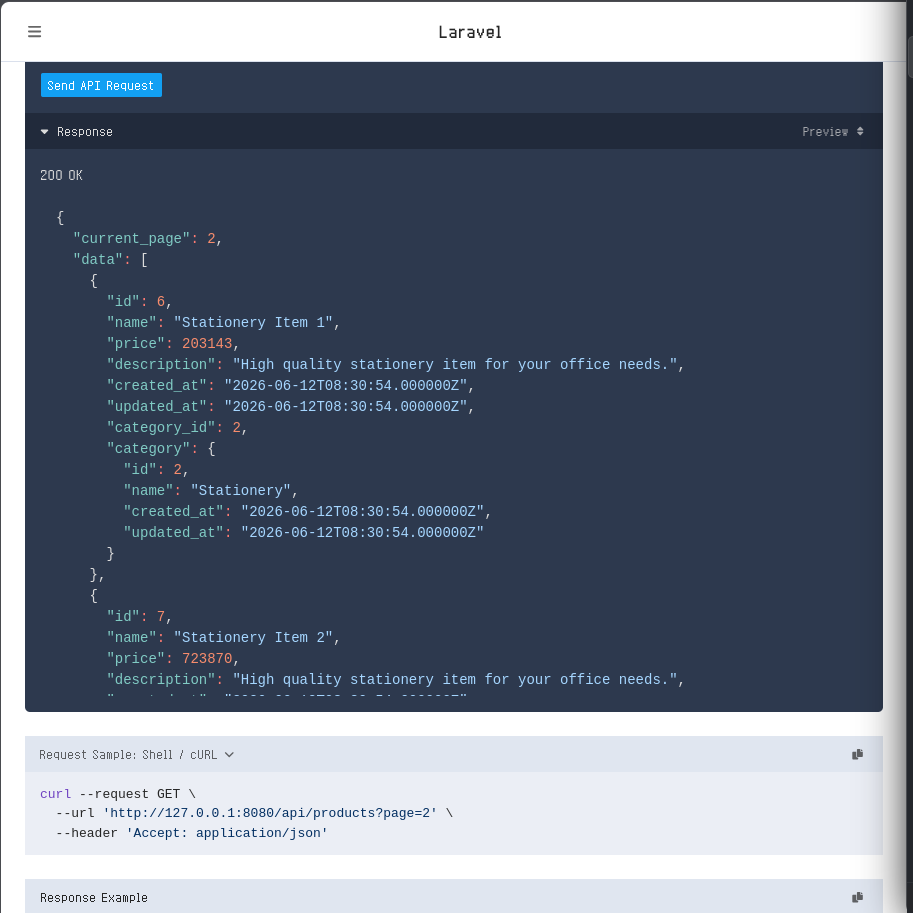

# **MODUL PRAKTIKUM PERTEMUAN 6**

## Implementasi Filtering, Searching, dan Pagination pada REST API

## **Tujuan Pembelajaran**
Setelah mengikuti praktikum ini mahasiswa mampu:

1. Memahami konsep query parameter pada REST API.
2. Mengimplementasikan pencarian data (search) pada API.
3. Mengimplementasikan filter data berdasarkan kategori.
4. Menggunakan pagination pada Laravel API.
5. Mengoptimalkan endpoint API agar lebih fleksibel.

---

## **Langkah Kerja Praktikum**

### A. Buka File Berikut
Buka file berikut pada direktori project Anda:
```
app/Http/Controllers/Api/ProductController.php
```

### B. Membuat Endpoint Filtering dan Search
Ubah method `index()` pada `ProductController.php` menjadi:
```php
public function index(Request $request)
{
    $query = Product::with('category');

    if ($request->search) {
        $query->where('name', 'like', '%' . $request->search . '%');
    }

    if ($request->category_id) {
        $query->where('category_id', $request->category_id);
    }

    return response()->json($query->get());
}
```
*Method ini memungkinkan API menerima parameter tambahan dari URL untuk pencarian dan pemfilteran.*

### C. Menguji Search Produk
Buka Postman, gunakan method **GET**, dan akses URL berikut:
```
http://127.0.0.1:8000/api/products?search=mouse
```
*Endpoint ini akan menampilkan produk yang memiliki kata "mouse" pada nama produknya.*

Screenshot:  

---



Response:  
```
{
  "current_page": 1,
  "data": [
    {
      "id": 1,
      "name": "Furniture Item 1",
      "price": 1070704,
      "description": "High quality furniture item for your office needs.",
      "created_at": "2026-06-12T08:30:54.000000Z",
      "updated_at": "2026-06-12T08:30:54.000000Z",
      "category_id": 1,
      "category": {
        "id": 1,
        "name": "Furniture",
        "created_at": "2026-06-12T08:30:54.000000Z",
        "updated_at": "2026-06-12T08:30:54.000000Z"
      }
    }
  ],
  "first_page_url": "http://127.0.0.1:8080/api/products?page=1",
  "from": 1,
  "last_page": 1,
  "last_page_url": "http://127.0.0.1:8080/api/products?page=1",
  "links": [
    {
      "url": null,
      "label": "&laquo; Previous",
      "page": null,
      "active": false
    },
    {
      "url": "http://127.0.0.1:8080/api/products?page=1",
      "label": "1",
      "page": 1,
      "active": true
    },
    {
      "url": null,
      "label": "Next &raquo;",
      "page": null,
      "active": false
    }
  ],
  "next_page_url": null,
  "path": "http://127.0.0.1:8080/api/products",
  "per_page": 5,
  "prev_page_url": null,
  "to": 1,
  "total": 1
}
```

---


### D. Menguji Filter Berdasarkan Kategori
Gunakan method **GET** dengan URL:
```
http://127.0.0.1:8000/api/products?category_id=1
```
*Endpoint ini akan menampilkan hanya produk yang berada pada kategori dengan ID 1.*

Screenshot:  

---



---

Response:  
```
{
  "current_page": 1,
  "data": [
    {
      "id": 1,
      "name": "Furniture Item 1",
      "price": 1070704,
      "description": "High quality furniture item for your office needs.",
      "created_at": "2026-06-12T08:30:54.000000Z",
      "updated_at": "2026-06-12T08:30:54.000000Z",
      "category_id": 1,
      "category": {
        "id": 1,
        "name": "Furniture",
        "created_at": "2026-06-12T08:30:54.000000Z",
        "updated_at": "2026-06-12T08:30:54.000000Z"
      }
    },
    {
      "id": 2,
      "name": "Furniture Item 2",
      "price": 683436,
      "description": "High quality furniture item for your office needs.",
      "created_at": "2026-06-12T08:30:54.000000Z",
      "updated_at": "2026-06-12T08:30:54.000000Z",
      "category_id": 1,
      "category": {
        "id": 1,
        "name": "Furniture",
        "created_at": "2026-06-12T08:30:54.000000Z",
        "updated_at": "2026-06-12T08:30:54.000000Z"
      }
    },
    {
      "id": 3,
      "name": "Furniture Item 3",
      "price": 1704851,
      "description": "High quality furniture item for your office needs.",
      "created_at": "2026-06-12T08:30:54.000000Z",
      "updated_at": "2026-06-12T08:30:54.000000Z",
      "category_id": 1,
      "category": {
        "id": 1,
        "name": "Furniture",
        "created_at": "2026-06-12T08:30:54.000000Z",
        "updated_at": "2026-06-12T08:30:54.000000Z"
      }
    },
    {
      "id": 4,
      "name": "Furniture Item 4",
      "price": 1930969,
      "description": "High quality furniture item for your office needs.",
      "created_at": "2026-06-12T08:30:54.000000Z",
      "updated_at": "2026-06-12T08:30:54.000000Z",
      "category_id": 1,
      "category": {
        "id": 1,
        "name": "Furniture",
        "created_at": "2026-06-12T08:30:54.000000Z",
        "updated_at": "2026-06-12T08:30:54.000000Z"
      }
    },
    {
      "id": 5,
      "name": "Furniture Item 5",
      "price": 469451,
      "description": "High quality furniture item for your office needs.",
      "created_at": "2026-06-12T08:30:54.000000Z",
      "updated_at": "2026-06-12T08:30:54.000000Z",
      "category_id": 1,
      "category": {
        "id": 1,
        "name": "Furniture",
        "created_at": "2026-06-12T08:30:54.000000Z",
        "updated_at": "2026-06-12T08:30:54.000000Z"
      }
    }
  ],
  "first_page_url": "http://127.0.0.1:8080/api/products?page=1",
  "from": 1,
  "last_page": 1,
  "last_page_url": "http://127.0.0.1:8080/api/products?page=1",
  "links": [
    {
      "url": null,
      "label": "&laquo; Previous",
      "page": null,
      "active": false
    },
    {
      "url": "http://127.0.0.1:8080/api/products?page=1",
      "label": "1",
      "page": 1,
      "active": true
    },
    {
      "url": null,
      "label": "Next &raquo;",
      "page": null,
      "active": false
    }
  ],
  "next_page_url": null,
  "path": "http://127.0.0.1:8080/api/products",
  "per_page": 5,
  "prev_page_url": null,
  "to": 5,
  "total": 5
}
```

### E. Menambahkan Pagination
Ubah bagian `return` pada method `index()` menjadi:
```php
return response()->json(
    $query->paginate(5)
);
```
*Dengan perubahan ini, API akan membatasi jumlah data yang ditampilkan menjadi 5 produk per halaman.*


### F. Menguji Pagination
Buka Postman, gunakan method **GET**, dan akses URL berikut:

```
http://127.0.0.1:8000/api/products?page=2
```
*Response akan berisi data pagination seperti:*

- `current_page`
- `total`
- `last_page`
- `data`

Screenshot:  

---



---

Response:  
```
{
  "current_page": 2,
  "data": [
    {
      "id": 6,
      "name": "Stationery Item 1",
      "price": 203143,
      "description": "High quality stationery item for your office needs.",
      "created_at": "2026-06-12T08:30:54.000000Z",
      "updated_at": "2026-06-12T08:30:54.000000Z",
      "category_id": 2,
      "category": {
        "id": 2,
        "name": "Stationery",
        "created_at": "2026-06-12T08:30:54.000000Z",
        "updated_at": "2026-06-12T08:30:54.000000Z"
      }
    },
    {
      "id": 7,
      "name": "Stationery Item 2",
      "price": 723870,
      "description": "High quality stationery item for your office needs.",
      "created_at": "2026-06-12T08:30:54.000000Z",
      "updated_at": "2026-06-12T08:30:54.000000Z",
      "category_id": 2,
      "category": {
        "id": 2,
        "name": "Stationery",
        "created_at": "2026-06-12T08:30:54.000000Z",
        "updated_at": "2026-06-12T08:30:54.000000Z"
      }
    },
    {
      "id": 8,
      "name": "Stationery Item 3",
      "price": 1486192,
      "description": "High quality stationery item for your office needs.",
      "created_at": "2026-06-12T08:30:54.000000Z",
      "updated_at": "2026-06-12T08:30:54.000000Z",
      "category_id": 2,
      "category": {
        "id": 2,
        "name": "Stationery",
        "created_at": "2026-06-12T08:30:54.000000Z",
        "updated_at": "2026-06-12T08:30:54.000000Z"
      }
    },
    {
      "id": 9,
      "name": "Stationery Item 4",
      "price": 949314,
      "description": "High quality stationery item for your office needs.",
      "created_at": "2026-06-12T08:30:54.000000Z",
      "updated_at": "2026-06-12T08:30:54.000000Z",
      "category_id": 2,
      "category": {
        "id": 2,
        "name": "Stationery",
        "created_at": "2026-06-12T08:30:54.000000Z",
        "updated_at": "2026-06-12T08:30:54.000000Z"
      }
    },
    {
      "id": 10,
      "name": "Stationery Item 5",
      "price": 92470,
      "description": "High quality stationery item for your office needs.",
      "created_at": "2026-06-12T08:30:54.000000Z",
      "updated_at": "2026-06-12T08:30:54.000000Z",
      "category_id": 2,
      "category": {
        "id": 2,
        "name": "Stationery",
        "created_at": "2026-06-12T08:30:54.000000Z",
        "updated_at": "2026-06-12T08:30:54.000000Z"
      }
    }
  ],
  "first_page_url": "http://127.0.0.1:8080/api/products?page=1",
  "from": 6,
  "last_page": 5,
  "last_page_url": "http://127.0.0.1:8080/api/products?page=5",
  "links": [
    {
      "url": "http://127.0.0.1:8080/api/products?page=1",
      "label": "&laquo; Previous",
      "page": 1,
      "active": false
    },
    {
      "url": "http://127.0.0.1:8080/api/products?page=1",
      "label": "1",
      "page": 1,
      "active": false
    },
    {
      "url": "http://127.0.0.1:8080/api/products?page=2",
      "label": "2",
      "page": 2,
      "active": true
    },
    {
      "url": "http://127.0.0.1:8080/api/products?page=3",
      "label": "3",
      "page": 3,
      "active": false
    },
    {
      "url": "http://127.0.0.1:8080/api/products?page=4",
      "label": "4",
      "page": 4,
      "active": false
    },
    {
      "url": "http://127.0.0.1:8080/api/products?page=5",
      "label": "5",
      "page": 5,
      "active": false
    },
    {
      "url": "http://127.0.0.1:8080/api/products?page=3",
      "label": "Next &raquo;",
      "page": 3,
      "active": false
    }
  ],
  "next_page_url": "http://127.0.0.1:8080/api/products?page=3",
  "path": "http://127.0.0.1:8080/api/products",
  "per_page": 5,
  "prev_page_url": "http://127.0.0.1:8080/api/products?page=1",
  "to": 10,
  "total": 25
}
```

---

## **Latihan**

Kerjakan tugas berikut:

1. Tambahkan minimal 5 produk baru ke database.
2. Gunakan endpoint search untuk mencari produk tertentu.
3. Gunakan endpoint filter category untuk menampilkan produk berdasarkan kategori.
4. Gunakan pagination untuk melihat halaman kedua dari data produk.

I think there is no need test this out.

---

## **Diskusi**

Jawab pertanyaan berikut:

## 1. Mengapa Pagination Penting dalam REST API?

Bayangkan jika sebuah aplikasi e-commerce memiliki 1.000.000 produk. Jika API mengirimkan *seluruh* data tersebut dalam satu kali *request*, aplikasi akan langsung melambat atau bahkan *crash*.

**Pagination** adalah teknik membagi sekumpulan data yang besar menjadi potongan-potongan kecil (per halaman) sebelum dikirim ke pengguna.

### Keuntungan Utama Pagination:

* **Meningkatkan Performa (Speed):** Server tidak perlu memproses jutaan baris data dari database sekaligus, sehingga waktu respons API menjadi jauh lebih cepat.
* **Menghemat Bandwidth:** Ukuran file JSON yang dikirimkan menjadi jauh lebih kecil (misal: hanya mengirim 20 data per halaman, bukan 1.000.000 data).
* **Mengurangi Beban Server & Database:** Membatasi jumlah data yang diambil berarti mengurangi penggunaan RAM dan CPU pada server database kamu.
* **User Experience (UX) yang Lebih Baik:** Aplikasi di sisi *client* (Mobile/Web) dapat memuat data secara bertahap (misalnya dengan tombol *"Next"* atau sistem *Infinite Scroll*).

---

## 2. Apa Keuntungan Menggunakan Query Parameter pada API?

**Query Parameter** adalah pasangan kunci dan nilai (key-value) yang ditambahkan di akhir URL setelah tanda tanya (`?`). Contoh: `/api/products?page=2&limit=10`.

### Keuntungan Menggunakannya:

* **Fleksibilitas Tanpa Mengubah Endpoint:** Kamu tidak perlu membuat banyak rute URL baru. Cukup gunakan satu URL dasar (`/api/products`), lalu gunakan parameter untuk mengubah hasil datanya.
* **Mudah Dibagikan (Bookmarkable & Sharable):** Karena semua instruksi ada di dalam URL, kamu bisa menyalin URL tersebut dan membagikannya ke orang lain. Orang tersebut akan melihat hasil yang *sama persis* (misal: hasil pencarian sepatu ukuran 42).
* **Standar untuk GET Request:** Mengikuti prinsip RESTful API, operasi membaca data (*Read*) yang membutuhkan modifikasi tampilan sebaiknya ditaruh di URL, bukan di dalam *Request Body*.
* **Mudah di-Cache:** Server atau CDN (Content Delivery Network) dapat dengan mudah menyimpan cache hasil respons berdasarkan URL yang spesifik tersebut untuk mempercepat akses berikutnya.

---

## 3. Apa Perbedaan Search dan Filtering pada API?

Meskipun keduanya digunakan untuk mempersempit data yang tampil, tujuan dan cara kerjanya di balik layar sangat berbeda:

| Fitur | **Filtering (Penyaringan)** | **Search (Pencarian)** |
| --- | --- | --- |
| **Definisi** | Mengambil data berdasarkan kriteria atau kategori yang **pasti dan spesifik**. | Mencari kecocokan data berdasarkan teks atau kata kunci yang **fleksibel**. |
| **Karakteristik** | Biasanya mencocokkan nilai yang sama persis (*exact match*). | Biasanya mencari kemiripan teks (*partial match* atau *fuzzy search*). |
| **Input Pengguna** | Dipilih melalui komponen UI seperti *Dropdown, Checkbox,* atau *Radio Button*. | Diketik secara manual oleh pengguna di dalam *Search Bar*. |
| **Contoh Query** | `?category_id=1` atau `?status=active` | `?q=sepatu+lari` atau `?search=meja` |
| **Logika SQL** | Menggunakan operator `=` (Sama dengan). <br>

<br>`WHERE category_id = 1` | Menggunakan operator `LIKE` dengan *wildcard*. <br>

<br>`WHERE name LIKE '%sepatu%'` |

### Contoh Kasus di Aplikasi:

Jika kamu membuka aplikasi belanja online:

* **Search:** Kamu mengetik kata *"Samsung"* di kolom pencarian. API akan mencari semua produk yang nama atau deskripsinya mengandung kata "Samsung".
* **Filtering:** Setelah hasil pencarian muncul, kamu mencentang opsi **Kondisi: Baru** dan **Rentang Harga: 2 Juta - 5 Juta**. API akan menyaring hasil pencarian tadi agar hanya menampilkan barang baru di rentang harga tersebut.

---

## **Kesimpulan**
Pada praktikum ini, mahasiswa telah mempelajari bagaimana membuat REST API yang lebih dinamis menggunakan *query parameter*. Dengan mengimplementasikan *filtering*, *search*, dan *pagination*, API dapat mengelola data dengan lebih efisien dan fleksibel. Teknik ini merupakan fondasi penting dalam pengembangan *backend* pada sistem *client-server* modern.
