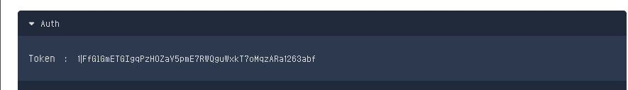
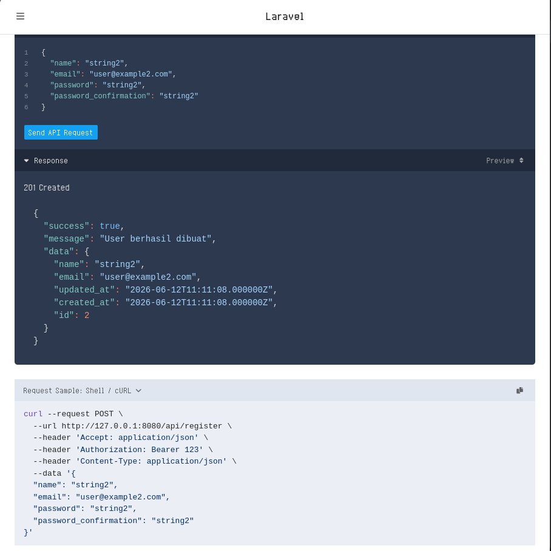
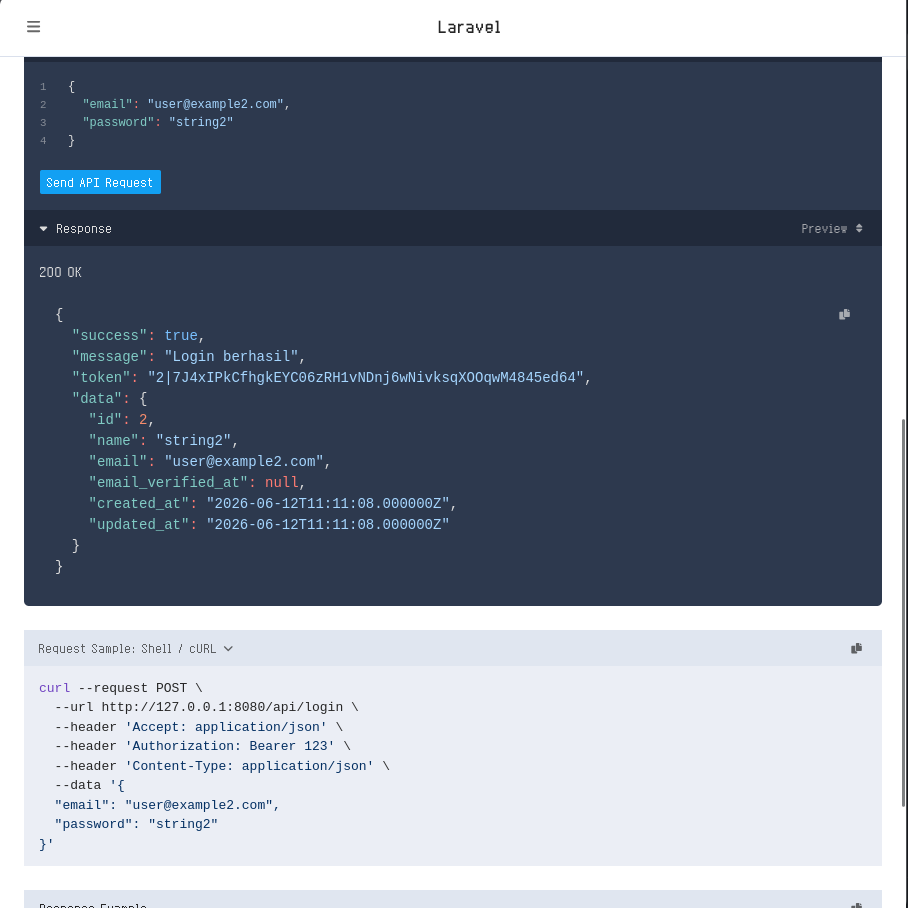
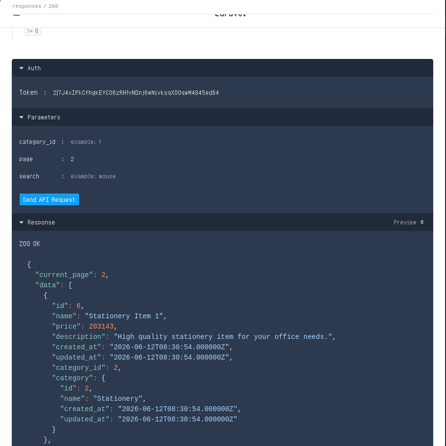
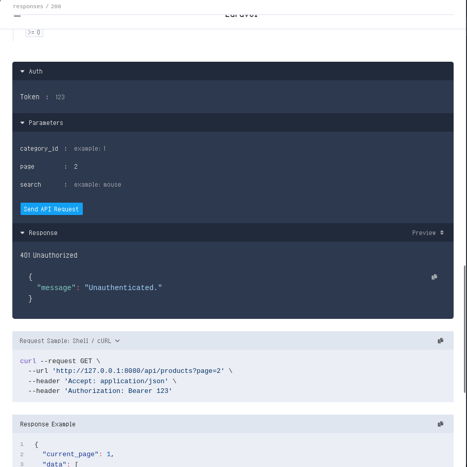

# **MODUL PRAKTIKUM PERTEMUAN 7**

## Implementasi Authentication pada REST API Laravel

## **Tujuan Pembelajaran**
Setelah mengikuti praktikum ini mahasiswa mampu:

1. Memahami konsep authentication pada sistem client–server.
2. Mengimplementasikan registrasi user melalui REST API.
3. Mengimplementasikan login API menggunakan token.
4. Mengamankan endpoint API menggunakan middleware authentication.
5. Menguji proses login dan akses API menggunakan Postman.

---

## **Langkah Kerja Praktikum**

### A. Membuat Model User
Laravel biasanya sudah menyediakan model `User` secara default.
Lokasi: `app/Models/User.php`

**Penting:** Tambahkan trait `HasApiTokens` dari `Laravel\Sanctum\HasApiTokens` ke dalam model `User` agar metode `createToken()` dapat digunakan.

```php
use Laravel\Sanctum\HasApiTokens;

class User extends Authenticatable
{
    use HasApiTokens, HasFactory, Notifiable;
    // ...
}
```

### B. Membuat Controller Authentication
Jalankan perintah berikut:
```bash
php artisan make:controller Api/AuthController
```
File controller akan dibuat di: `app/Http/Controllers/Api/AuthController.php`

### C. Membuat Endpoint Register
Tambahkan kode berikut pada `AuthController.php`:
```php
public function register(Request $request)
{
    $validated = $request->validate([
        'name' => 'required|string|max:100',
        'email' => 'required|email|unique:users,email',
        'password' => 'required|string|min:6|confirmed',
    ]);

    $user = User::create([
        'name' => $validated['name'],
        'email' => $validated['email'],
        'password' => $validated['password'],
    ]);

    return response()->json([
        'success' => true,
        'message' => 'User berhasil dibuat',
        'data' => $user
    ], 201);
}
```

### D. Membuat Endpoint Login
Tambahkan kode berikut pada `AuthController.php`:
```php
public function login(Request $request)
{
    $validated = $request->validate([
        'email' => 'required|email',
        'password' => 'required|string',
    ]);

    $credentials = [
        'email' => $validated['email'],
        'password' => $validated['password'],
    ];

    if (!Auth::attempt($credentials)) {
        throw ValidationException::withMessages([
            'email' => ['Email atau password salah.'],
        ]);
    }

    /** @var \App\Models\User $user */
    $user = Auth::user();
    $token = $user->createToken('api-token')->plainTextToken;

    return response()->json([
        'success' => true,
        'message' => 'Login berhasil',
        'token' => $token,
        'data' => $user
    ]);
}
```

### E. Menambahkan dan Melindungi Route API
Buka file `routes/api.php`. Tambahkan route untuk register dan login, kemudian bungkus endpoint yang memerlukan autentikasi di dalam middleware `auth:sanctum`.

```php
use App\Http\Controllers\Api\AuthController;

Route::post('register', [AuthController::class, 'register']);
Route::post('login', [AuthController::class, 'login']);

Route::middleware('auth:sanctum')->group(function () {
    // Endpoint yang memerlukan autentikasi
    Route::get('/ping', [ServerController::class, 'ping']);
    // ... route lainnya
});
```


### F. Menguji Register dan Login Menggunakan Scramble

Scramble secara otomatis mendokumentasikan API Laravel. Untuk mengujinya:

1. Pastikan package `dedoc/scramble` sudah terinstal.
2. Buka browser dan akses `http://127.0.0.1:8000/docs/api`.
3. Anda dapat langsung mencoba endpoint `register` dan `login` melalui interface Scramble.

### H. Menggunakan Token pada Request API
Token yang diperoleh dari login digunakan pada *Authorization Header*:

* Pilih **Authorization** -> **Bearer Token**
* Masukkan token yang diperoleh.



---

## **Latihan**

1. Lakukan registrasi user baru menggunakan API.
    
2. Login menggunakan akun tersebut.
    
3. Gunakan token yang diperoleh untuk mengakses endpoint API.
        
4. Amati respon server jika token tidak diberikan.
    

---

## **Diskusi**
1. Mengapa authentication penting dalam sistem client–server?  
    - Mencegah akses illegal
2. Apa fungsi token pada REST API?  
    - Identitas untuk akses endpoint
3. Apa risiko jika API tidak menggunakan authentication?  
    - Endpoint berisiko di-abuse oleh aktor pihak ke-3 yang berbahaya

---

## **Kesimpulan**
Pada praktikum ini, mahasiswa telah mempelajari bagaimana mengimplementasikan *authentication* pada REST API Laravel menggunakan token. *Authentication* memastikan bahwa hanya pengguna yang sah yang dapat mengakses layanan API.
